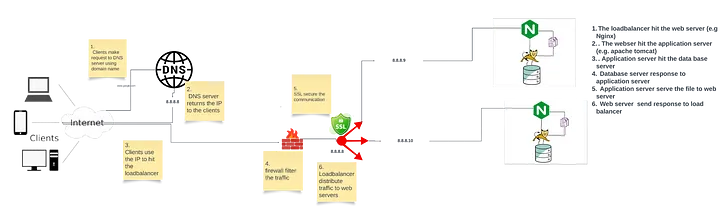

#  What Happens When You Type google.com in Your Browser and Press Enter

## This question encompasses the following area
+ Client
+ DNS
+ TCP/IP
+ Firewall
+ Https/SSL
+ Loadbalancer
+ Web Server
+ Application Server
+ Database Server

### Client
-  Is a devcie that contains sofware which can surf internet. Example of this software is the google chrome web browser that contains area where the  URL can be typed in. The moment the URL is typed in (e.g. www.google.com) and enter key is pressed, communication has started between the web browser and DNS server using TCP/IP protocol. The browser send request to DNS server on port 53

### TCP/IP
- TCP/IP stands for Transmission Control Protocol/Internet Protocol and is a suite (i.e. a set of) of communication protocols used to interconnect network devices on the internet. TCP/IP  address how that data transmitted over internet should be broken down, addressed, tranmitted, routed and received.
The TCP aspect is responsible for how the data is broken down based on mtu (maximum transfer unit)```ip link``` command on Linux will show the mtu value, transmitted and re-arranged at the destination.
The IP part is responsible for how the transmission is addressed to reach the target server

### DNS Server

**DNS Resolution**:
   - The browser sends a DNS (Domain Name System) query throuhg DNS lookup ```nslookup google.com``` to a *DNS resolver* to translate the domain name "www.google.com" into an IP address.
   - When a DNS resolver needs to resolve a domain name, it first queries  the
its cache for a cached entry for "www.google.com" to see if it has previously resolved the IP address and return the ip to the browser if found else, resolver proceed to query the root nameservers to find the authoritative nameservers for the top-level domain (TLD e.g .com)  <sub>from www.netnod.se</sub><br>
 of the domain in question. The TLD nameservers then provide the authoritative nameservers(the server that hold the A record) for the specific domain.

   - The root server responds with the IP address of the TLD nameserver responsible for the ".com" TLD.
The resolver then queries this TLD nameserver for the authoritative nameserver for "google.com".
   - The TLD nameserver responds with the IP address of Google's authoritative nameserver.The resolver sends a DNS query to Google's authoritative nameserver, requesting the IP address of "www.google.com".
   - Google's authoritative nameserver responds with the IP address associated with "www.google.com".The resolver caches the IP address obtained for "www.google.com" for future use.
   - This IP is added to the destination IP of the TCP/IP datagram and used to make request to the server(load balancer, backend or frontend)
 - In front of theses servers are set of security device which may include firewall and SSL/TLS as well as any other security service


###  FIREWALL


A firewall is a network security device or software that monitors and controls incoming and outgoing network traffic based on predetermined security rules. It acts as a barrier between a trusted internal network and untrusted external networks, such as the internet, to prevent unauthorized access and protect against malicious activities.
 
**Types of Firewalls**:
There are several types of firewalls, each with its own characteristics and functionalities:

1. **Packet Filtering Firewall**:
   - Operates at the network layer (Layer 3) of the OSI model.
   - Examines individual packets of data as they pass through the firewall.
   - Filters packets based on predefined rules, such as source/destination IP addresses, port numbers, and protocols.
   - Fast and efficient but less secure compared to other types of firewalls.

2. **Stateful Inspection Firewall**:
   -  Also known as a dynamic packet filtering firewall.
   - Maintains state information about active connections.
   - Analyzes the context of network traffic to make more intelligent filtering decisions.
   - Offers better security than packet filtering firewalls by considering the state of connections.

3. **Proxy Firewall**:
   - Acts as an intermediary between clients and servers.
   - Receives requests from clients on one side and forwards them to servers on the other side.
   - Inspects and filters traffic at the application layer (Layer 7) by examining the contents of packets.
   - Provides enhanced security and content filtering capabilities but may introduce latency.

4. **Next-Generation Firewall (NGFW)**:
   - Combines traditional firewall functionalities with advanced security features, such as intrusion prevention, application awareness, and deep packet inspection.
   - Offers enhanced threat detection and prevention capabilities to combat modern cyber threats.
   - Provides granular control over applications and users accessing the network.

5. **Unified Threat Management (UTM) Firewall**:
   - Integrates multiple security features into a single appliance, including firewalling, antivirus, intrusion detection/prevention, VPN, and content filtering.
   - Offers a comprehensive approach to network security management and simplifies administration.
   - Suitable for small to medium-sized enterprises looking for all-in-one security solutions.

**Function of Firewalls**:
- **Access Control**: Firewalls enforce access control policies to allow or deny network traffic based on predefined rules and security policies.
- **Packet Inspection**: They inspect incoming and outgoing packets to identify and block potentially harmful traffic.
- **Network Segmentation**: Firewalls can segment networks into multiple zones to isolate critical assets and restrict lateral movement by attackers.
- **Logging and Monitoring**: They log network traffic and security events for audit trails and real-time monitoring of network activity.
- **VPN Support**: Many firewalls include VPN (Virtual Private Network) capabilities to provide secure remote access for remote users and branch offices.

### Htpps/SSL


HTTPS (Hypertext Transfer Protocol Secure) is the secure version of HTTP, the protocol used for transmitting data over the internet. It adds a layer of encryption to HTTP by using SSL/TLS protocols to secure communication between clients and servers. SSL (Secure Sockets Layer) and its successor, TLS (Transport Layer Security), provide secure communication channels over unsecured networks, such as the internet.


To actvate SSL/TLS for your site

CLIENT CERTIFICATE SINGNED BY SERVER (browser)
- Generate a private key and certicate
```openssl genrsa -out client.key 2048```

- Generate a certificate signing request (CSR) O is the group name
```openssl req -new -key client.key -out client.csr -subj "/CN=your-domainname/O=hostname:username"```

- Generate a  certificate  signed by server
```openssl x509 -req -days 365 -in client.csr -CA server.crt -CAkey server.key -CAcreateserial -out client.crt```

- Upload the certicate to the server that has access to internet gateway and point the certificate and key to the server in its config file


Here's a basic overview of HTTPS/SSL:


1. **SSL/TLS Handshake**:
   - When a client (such as a web browser) initiates a connection to a server over HTTPS, an SSL/TLS handshake occurs.
   - During the handshake, the client and server negotiate encryption algorithms and exchange cryptographic keys to establish a secure connection.

2. **Encryption**:
   - Once the SSL/TLS handshake is complete, data exchanged between the client and server is encrypted using symmetric encryption keys.
   - Symmetric encryption ensures that data transmitted over the network is secure and cannot be intercepted by malicious parties.

3. **Certificate Authorities (CAs)**:
   - SSL/TLS certificates are issued by Certificate Authorities (CAs), which are trusted third-party organizations responsible for verifying the identity of website owners by using it to sign the user certificate and user key .
   - SSL certificates contain information about the website owner, the domain name(s) for which the certificate is issued, and the public key used for encryption.
   - Browsers and other client applications trust certificates issued by recognized CAs, allowing them to establish secure connections without warnings or errors.


4. **SSL/TLS Configuration**:
   - To enable HTTPS on a web server, you need to configure the server to use SSL/TLS certificates.
   - Obtain an SSL certificate from a trusted CA, either by purchasing one or using a free certificate authority like Let's Encrypt.
   - Install the SSL certificate on the web server and configure the server software (e.g., Apache, Nginx) to use HTTPS.

5. **HTTPS Benefits**:
   - Data Confidentiality: HTTPS encrypts data transmitted between clients and servers, preventing eavesdropping and data interception.
   - Data Integrity: HTTPS ensures that data remains unchanged during transmission, protecting against data tampering.
   - Authentication: SSL/TLS certificates validate the identity of website owners, providing assurance to users that they are connecting to legitimate websites.
   - Trustworthiness: Browsers display visual indicators (such as a padlock icon) to indicate secure HTTPS connections, instilling trust in users.
   - 
  

### Load balancer 

if the environment is highly avaialble environment(loadbalancer in front of many identical server), load balancer plays important role in traffic distribution
A load balancer is a critical component in a network architecture that distributes incoming network traffic across multiple servers. It acts as a reverse proxy, accepting incoming requests from clients and forwarding them to a set of backend servers. Load balancers are commonly used to improve the performance, reliability, and scalability of web applications and services.

Here are some key aspects of load balancers:

1. **Distribution of Traffic**: Load balancers evenly distribute incoming requests across multiple backend servers. This prevents any single server from becoming overwhelmed with traffic, improving overall performance and responsiveness.

2. **High Availability**: Load balancers can detect when a server becomes unavailable or unresponsive and automatically route traffic away from it. This ensures that if one server fails, the others can continue to handle requests, increasing the reliability of the system.

3. **Scalability**: Load balancers can dynamically add or remove servers from the pool based on demand. This allows applications to scale horizontally by adding more servers to handle increased traffic without downtime or service disruption.

4. **Health Monitoring**: Load balancers continuously monitor the health and performance of backend servers by periodically sending health checks. If a server fails to respond or performs poorly, the load balancer can stop sending traffic to it until it becomes healthy again.

5. **Session Persistence**: Some load balancers support session persistence, also known as sticky sessions, where requests from the same client are consistently routed to the same backend server. This is useful for applications that require stateful communication with clients.

6. **SSL Termination**: Load balancers can handle SSL encryption and decryption, offloading this resource-intensive task from backend servers. This improves performance and simplifies server configuration.

7. **Content-Based Routing**: Advanced load balancers can route requests based on specific criteria such as URL paths, HTTP headers, or request parameters. This enables more sophisticated traffic management and routing strategies.

Overall, load balancers play a crucial role in ensuring the availability, performance, and scalability of modern web applications and services by intelligently distributing incoming traffic across multiple servers.

### Web server

A web server is software that serves web pages to users in response to their requests over the internet. It handles incoming HTTP requests from clients (such as web browsers) and sends back the requested web pages, along with any other resources (such as images, scripts, or stylesheets) necessary to render the page correctly. This web server receive request from load balancer and send respond back to the same load balancer

Here are some key aspects of web servers:

1. **Request Handling**: Web servers listen for incoming HTTP requests on a specified port (usually port 80 for HTTP and port 443 for HTTPS). When a request is received, the web server processes it and determines how to respond based on the requested resource and any relevant configuration settings.

2. **Static Content Serving**: Web servers are responsible for serving static content, such as HTML files, images, CSS files, JavaScript files, and other types of files that do not change dynamically. These files are typically stored on the server's filesystem and served directly to clients upon request.

3. **Dynamic Content Generation**: In addition to serving static content, web servers can also generate dynamic content in response to client requests. This often involves running server-side scripts or programs that generate HTML content dynamically based on user input, database queries, or other factors.

4. **Concurrency and Scalability**: Web servers are designed to handle multiple concurrent connections efficiently. They often use techniques such as multithreading or asynchronous I/O to process incoming requests concurrently and avoid blocking when handling long-running tasks. Web servers can also be configured to scale horizontally by running multiple instances across multiple servers and distributing incoming traffic among them using a load balancer.

5. **Security**: Web servers implement various security measures to protect against common threats such as unauthorized access, denial-of-service attacks, and injection attacks. This includes features such as access control, encryption (e.g., SSL/TLS), request filtering, and secure authentication mechanisms.

6. **Logging and Monitoring**: Web servers typically log information about incoming requests, including details such as the client's IP address, the requested URL, the response status code, and other relevant metadata. These logs can be used for troubleshooting, performance analysis, and security auditing purposes.

Some popular web servers include:

- Apache HTTP Server: An open-source web server widely used for serving static and dynamic content on the internet.
- Nginx: A high-performance, lightweight web server and reverse proxy server known for its scalability and efficiency in handling concurrent connections.
- Microsoft Internet Information Services (IIS): A web server developed by Microsoft for hosting websites and web applications on Windows servers.
- Apache Tomcat: A Java-based web server and servlet container that specializes in serving Java web applications, particularly those based on JavaServer Pages (JSP) and Java Servlets.


### Application server
An application server is a software framework or platform that provides a runtime environment for executing applications, typically web-based applications, and services. While web servers primarily handle the HTTP protocol and serve static and, sometimes, dynamic content, application servers offer additional functionality and support for running more complex and dynamic applications, including business logic and database access.

Here are some key aspects of application servers:

1. **Execution Environment**: Application servers provide a runtime environment in which applications can run. This environment typically includes features such as a runtime engine, libraries, and services necessary for executing and managing applications.

2. **Support for Multiple Protocols**: While web servers focus mainly on the HTTP protocol, application servers can support a broader range of protocols and communication mechanisms, including HTTP, TCP/IP, RMI (Remote Method Invocation), CORBA (Common Object Request Broker Architecture), and more.

3. **Middleware Services**: Application servers often include middleware services that simplify the development and deployment of applications. These services may include transaction management, security, messaging, caching, clustering, and connection pooling.

4. **Business Logic Execution**: One of the primary functions of an application server is to execute the business logic of applications. This includes processing user requests, performing calculations, accessing databases, interacting with other systems, and generating dynamic content.

5. **Database Access**: Application servers typically provide built-in support for connecting to and interacting with databases. They often include connection pooling mechanisms to manage database connections efficiently and support for various database management systems (DBMS) and data access technologies.

6. **Scalability and Load Balancing**: Application servers are designed to scale horizontally and handle large numbers of concurrent users and transactions. They may support clustering, load balancing, and distributed computing to distribute workloads across multiple servers and ensure high availability and performance.

7. **Integration with Development Tools**: Application servers often integrate with development tools, frameworks, and IDEs (Integrated Development Environments) to streamline the development, testing, and deployment of applications. They may provide support for development frameworks such as Java EE (Enterprise Edition), .NET, and others.

8. **Security Features**: Application servers include security features to protect applications and data from unauthorized access, tampering, and other security threats. This may include authentication, authorization, encryption, role-based access control, and auditing mechanisms.

Some popular application servers include:

- Apache Tomcat: A lightweight, open-source application server and servlet container that supports Java-based web applications, particularly those based on JavaServer Pages (JSP) and Java Servlets.
- IBM WebSphere Application Server: An enterprise-grade application server developed by IBM that supports Java EE applications and provides advanced features for scalability, security, and reliability.
- Red Hat JBoss Enterprise Application Platform (EAP): An open-source application server developed by Red Hat that supports Java EE applications and includes features for high availability, clustering, and management.
- Oracle WebLogic Server: A commercial application server developed by Oracle that supports Java EE applications and provides features for scalability, reliability, and performance optimization.

Overall, application servers play a crucial role in the development, deployment, and management of modern web-based applications and services, providing a robust and scalable runtime environment for executing business logic and delivering dynamic content to users.


### Databases
Databases are crucial components of many applications, allowing for efficient storage, retrieval, and manipulation of data. There are various types of databases, each designed for specific use cases and requirements. Here are some common types of databases:

1. **Relational Databases (RDBMS)**:
   - Relational databases organize data into tables with rows and columns, where each row represents a record and each column represents a data attribute.
   - Examples include MySQL, PostgreSQL, Oracle Database, Microsoft SQL Server, and SQLite.
   - Relational databases use structured query language (SQL) for querying and manipulating data.

2. **NoSQL Databases**:
   - NoSQL databases (Not Only SQL) are non-relational databases that store data in a flexible, schema-less format.
   - They are often used for handling large volumes of unstructured or semi-structured data, as well as for real-time applications and distributed systems.
   - Examples include MongoDB, Cassandra, Redis, Couchbase, and Amazon DynamoDB.

3. **Key-Value Stores**:
   - Key-value stores are simple databases that store data as a collection of key-value pairs.
   - They are optimized for high-speed data retrieval and are commonly used for caching, session storage, and distributed data storage.
   - Examples include Redis, Riak, Memcached, and Amazon DynamoDB (as a key-value option).

4. **Document Stores**:
   - Document stores store semi-structured data as documents, typically in JSON or BSON format.
   - They are suitable for applications with complex, hierarchical data structures.
   - Examples include MongoDB, Couchbase, CouchDB, and Amazon DocumentDB.

5. **Column-Family Stores**:
   - Column-family stores organize data into columns rather than rows, allowing for efficient storage and retrieval of wide, sparse data sets.
   - They are often used for data warehousing, time series data, and analytics.
   - Examples include Apache Cassandra, HBase, and ScyllaDB.

6. **Graph Databases**:
   - Graph databases model data as nodes, edges, and properties, enabling efficient traversal of relationships between data entities.
   - They are used for applications that require complex relationship querying and analysis, such as social networks, recommendation engines, and fraud detection.
   - Examples include Neo4j, Amazon Neptune, JanusGraph, and ArangoDB.

The choice of database depends on factors such as the nature of the data, the scalability and performance requirements, the complexity of the application, and the development team's familiarity with the technology. In many cases, applications may use a combination of different database types to meet various requirements.




